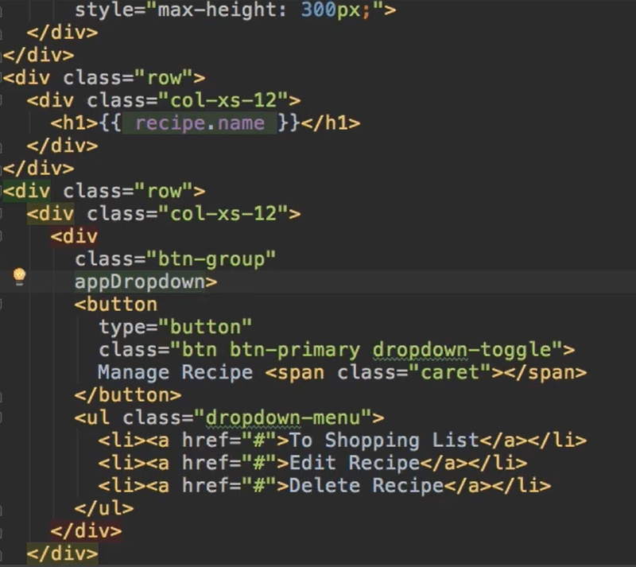
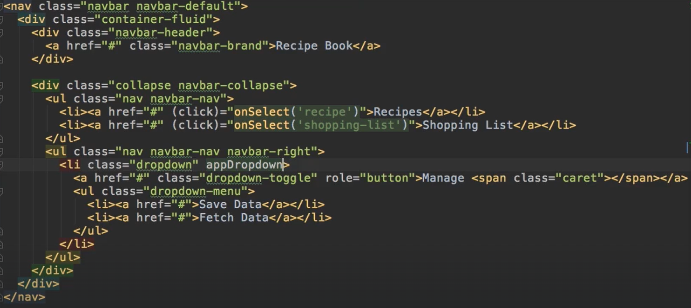

# Building and Using a Dropdown Directive in Angular

Create a dropdown.directives.ts (in a shared app folder)
    > export class DropdownDirective {
        > @HostBinding('class.open') isOpen = false;
    >
        >  @HostListener('click') toggleOpen() {
        >   this.isOpen = !this.isOpen;
        >   }
    > }

**NOTE** *Be sure to add **HostListener** and **HostBinding** to your import list @ang/core*
**NOTE2** *If created .ts manually (and not by cli), be sure to add your imports to the main **app.module.ts** file (under the ngMod declarations AND import)*

## Add the Dropdown feature in your code

Add to button group class (btn-group)
    > i.e.: 

    > now looks like this:
    >> 

**NOTE** *code does not need square brackets or to assign any values as you are not configuring anything, simply adding the already configured dropdown function*

Also attach to other div or 'element' where you want to open something with a list
    > i.e.: since you're using a shared folder to create your dropdown feature; attach to any div with btn-group class or add in the Header where you need to 'open' something

**EXAMPLE SCREENSHOTS:**

-----------------------------
**NOTE:** *For a Dropdown that can be closed by a click anywhere outside of box, use the following code in place of dropdown.directive.ts*

import {Directive, ElementRef, HostBinding, HostListener} from '@angular/core';
@Directive({
  selector: '[appDropdown]'
})
export class DropdownDirective {
  @HostBinding('class.open') isOpen = false;
  @HostListener('document:click', ['$event']) toggleOpen(event: Event) {
    this.isOpen = this.elRef.nativeElement.contains(event.target) ? !this.isOpen : false;
  }
  constructor(private elRef: ElementRef) {}
}